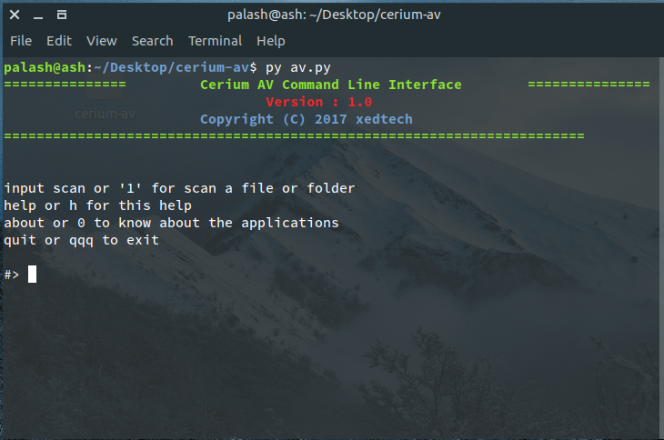
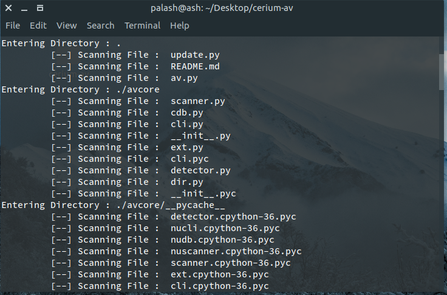

# Project Cerium : Antivirus
> On a Mission to make the world more secure

## Open Source Antivirus For Humans

## How to Use
clone the repo : `git clone https://github.com/xedtech/ceriumav.git`

`cd ceriumav`

`python3 av.py`

 

 
